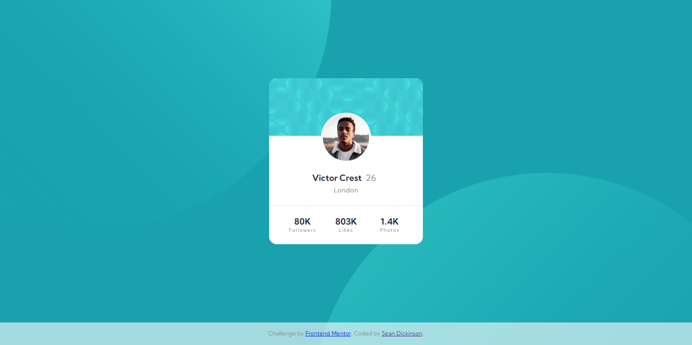

# Frontend Mentor - Profile card component solution

This is a solution to the [Profile card component challenge on Frontend Mentor](https://www.frontendmentor.io/challenges/profile-card-component-cfArpWshJ). Frontend Mentor challenges help you improve your coding skills by building realistic projects. 

## Table of contents

- [Overview](#overview)
  - [The challenge](#the-challenge)
  - [Screenshot](#screenshot)
  - [Links](#links)
- [My process](#my-process)
  - [Built with](#built-with)
- [Author](#author)

## Overview

### The challenge

- Build out the project to the designs provided

### Screenshot

### Links

- Solution URL: [Add solution URL here](https://github.com/atinybeardedman/profile-card-component)
- Live Site URL: [Add live site URL here](https://inspiring-booth-a07029.netlify.app)

## My process

I approached this simple card using a mobile first workflow, only to realize the card itself doesn't change at all for the desktop version so there wasn't much to do regarding responsive design. 

I built out the layout for the card and background using flexbox and found it to be mostly what I was expecting. The colors given in the style guide were particularly representative of the design. Yes they were used, but there is a color used for the border between the card sections that isn't listed, and I couldn't find where they had used the "Very dark desaturated blue" color at all.

### Feedback

- I am unsure of the best way of approaching the background images in this case. I could not seem to find the best option for how to place them. I attempted to use vw units to make them responsive, but that seems to be a bad choice given how they react on size changes. Any suggestions would be appreciated here.

- I didn't like having to explicitly set a height for the card background section of the card, as it looked like it was about 1/3 of the card. However I had no choice (that I could see) as I didn't want to set an explicit height for the card and thus using a percentage for the height would have no affect. Perhaps I could have forced this with flex grow? I might try that to see if it works.

### Built with

- Semantic HTML5 markup
- Flexbox
- Mobile-first workflow

## Author

- Website - [Sean Dickinson](https://seandickinson.dev)
- Frontend Mentor - [@atinybeardedman](https://www.frontendmentor.io/profile/atinybeardedman)
